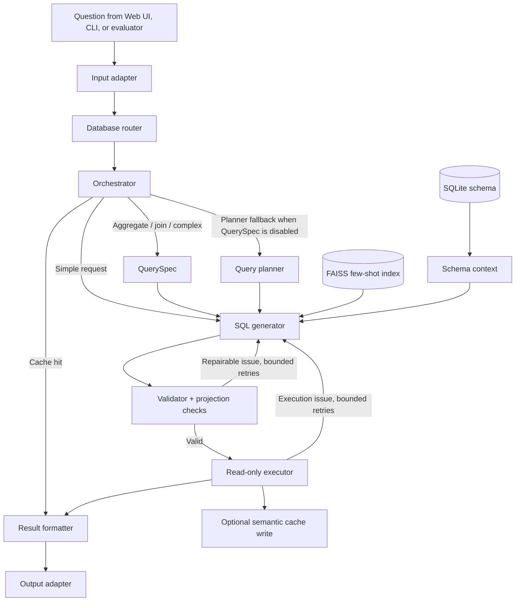

# Multi-Agent Text-to-SQL

[](https://www.python.org/)
[](https://langchain-ai.github.io/langgraph/)
[](https://www.sqlite.org/)
[](https://ai.google.dev/)

An inspectable, Vietnamese-first Text-to-SQL system for SQLite. It turns a natural-language question into a safe `SELECT` query, executes it, and returns both the answer and the SQL behind it.

The project uses a LangGraph workflow rather than a single opaque prompt. A structured **QuerySpec**, schema grounding, few-shot retrieval, validation, bounded repair, telemetry, and an optional semantic cache make the pipeline easier to evaluate and improve.

> This is a research and thesis project. It is designed for read-only SQLite querying and is not a substitute for access control, database governance, or production security review.

## Why this project

- Vietnamese and English questions over SQLite databases.
- Dynamic schema introspection whenever the selected database changes.
- A structured QuerySpec for requested projection, tables, filters, grouping, ordering, and limit.
- Read-only validation and bounded SQL repair with per-node telemetry.
- FAISS few-shot retrieval for generation and a separate conservative semantic cache for repeated requests.
- Reproducible evaluation with execution metrics, AST diagnostics, latency, tokens, LLM calls, checkpoints, and ablation profiles.

## Architecture at a glance



Read the component-level explanation in [docs/ARCHITECTURE.md](docs/ARCHITECTURE.md).

## Quick start

### 1. Requirements

- Python 3.10 or newer
- A Google Gemini API key
- Windows, macOS, or Linux

### 2. Install

```bash
git clone <your-fork-url>
cd text_to_sql

python -m venv venv
# Windows PowerShell
.\\venv\\Scripts\\Activate.ps1
# macOS/Linux
# source venv/bin/activate

pip install -r requirements.txt
Copy-Item .env.example .env  # Windows PowerShell
# cp .env.example .env       # macOS/Linux
```

Set `GEMINI_API_KEY` in `.env`. You may also set `LLM_MODEL_FLASH`, `LLM_MODEL_PRO`, and `EMBEDDING_MODEL`.

### 3. Run the web app

```bash
streamlit run app/main.py
```

Open `http://localhost:8501`, select or upload a SQLite database, then ask:

```text
Liệt kê 5 khách hàng đầu tiên theo tên công ty.
```

### 4. Run one query from Python

```python
from src.graph import run_query

result = run_query(
    "Liệt kê 5 khách hàng đầu tiên theo tên công ty.",
    db_path="data/northwind/northwind.sqlite",
    dataset_type="northwind",
    analysis_mode="fast",
    evaluation_profile="full_no_cache",
)

print(result.generated_sql)
print(result.formatted_answer["detailed_answer"])
```

`fast` formats results locally to reduce LLM calls. `deep` additionally asks the formatter LLM for a richer answer; the UI exposes it as a future Pro experience.

## Evaluation

The evaluator clears the semantic cache before an accuracy run and writes JSON, CSV, and an incremental checkpoint. For comparable results, keep the model, profile, input data, seed, and evaluation mode fixed.

```bash
python test/evaluate_v2.py \
  --data data/northwind_test_100_balanced_fixed.json \
  --db data/northwind/northwind.sqlite \
  --dataset-type northwind \
  --profile full_no_cache \
  --analysis-mode fast \
  --seed 42 \
  --clear-checkpoint \
  --output-dir test/evaluation_runs \
  --name northwind_run
```

`full_no_cache` is the main accuracy profile: it retains few-shot retrieval, QuerySpec, validation, and repair while disabling cache hits. Other profiles include `no_rag`, `no_query_spec`, `no_planner`, `no_validator`, `single_zero_shot`, and `single_structured` for ablation experiments.

### Reported final-candidate results

These runs used `gemini-2.5-pro`, `full_no_cache`, `fast` mode, seed 42, and cache disabled for accuracy. Strict execution compares result values, column order, and duplicate rows; relaxed execution is less sensitive to output labels.

| Dataset | N | Strict EX | Relaxed EX | Exec OK | Mean tokens/query | Mean latency |
| --- | ---: | ---: | ---: | ---: | ---: | ---: |
| Chinook VN | 300 | 85.00% | 88.67% | 100.00% | 8,042 | 25.44 s |
| Northwind VN | 100 | 86.00% | 93.00% | 100.00% | 7,765 | 27.28 s |
| Internal Spider subset | 100 | 76.00% | 83.00% | 98.00% | 8,804 | 37.59 s |

Results are dataset- and configuration-specific, not a claim of general performance across all Text-to-SQL benchmarks. Detailed artifacts and limitations are in [evaluation_outcomes_and_limitations.md](evaluation_outcomes_and_limitations.md).

## Repository map

```text
app/                    Streamlit chat interface, charts, and session UI
src/agents/             LangGraph nodes: routing, QuerySpec, planning, SQL, validation, execution, formatting
src/rag/                Schema context, embeddings, and FAISS few-shot retrieval
src/memory/             Conservative, database-scoped semantic cache
src/evaluation/         Profiles, metrics, telemetry, baselines, and ablation helpers
src/db/                 SQLite introspection and read-only query execution
test/evaluate_v2.py     Batch evaluator with JSON/CSV/checkpoint artifacts
tests/                  Unit and regression tests
data/                   Local datasets and SQLite databases (not all are intended for redistribution)
docs/                   Architecture and thesis-supporting documentation
```

## Development

```bash
pytest -q
```

Before opening a pull request, please add or update a focused test for behavioral changes. Keep dataset-specific benchmark metadata in evaluator/data files, and avoid putting benchmark answers into prompts or production routing logic.

## Contributing and supporting the project

See [CONTRIBUTING.md](CONTRIBUTING.md) for a short guide to reporting reproducible Text-to-SQL failures and proposing changes. Ideas for schema linking, retrieval, multilingual evaluation, and reproducibility are welcome.

If this project helps your research or gives you a useful starting point, consider starring the repository and sharing a concrete issue or improvement. That feedback is more useful than a silent star count.

## Citation

If you use this repository in academic work, cite the associated thesis and link to the commit or release you evaluated. A formal citation file can be added once the thesis metadata is finalized.
