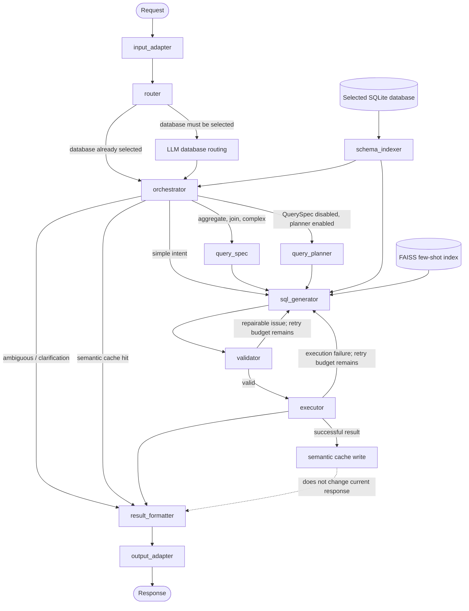

# Architecture

## Scope

This repository implements a LangGraph-based, read-only Text-to-SQL workflow. The primary runtime target is SQLite, with a Streamlit interface, a CLI, and a batch evaluator. A request produces SQL, its execution result, a user-facing answer, and per-node telemetry.

The system supports Vietnamese and English questions. Behavior depends on the selected database, model configuration, evaluation profile, and optional benchmark context.

## Runtime flow



The graph is defined in [src/graph.py](../src/graph.py). `input_adapter` and `output_adapter` bridge LangGraph messages and the application state; they are nodes but do not call an LLM.

## Components

| Component | Runtime role | LLM use |
| --- | --- | --- |
| Input adapter | Normalizes input, extracts a few regex entities, detects narrow fast routes, and sets dialect metadata. | No |
| Router | Selects a database only when a database has not already been supplied. | Conditional |
| Orchestrator | Obtains schema context, checks the optional cache, classifies intent, and chooses the next graph branch. | Conditional |
| QuerySpec | Creates a structured contract for output columns, source tables, filters, aggregation, grouping, order, and limit. | Yes |
| Query planner | Produces a step plan when QuerySpec is disabled and planning is required. | Yes |
| SQL generator | Generates SQL from the question, schema context, QuerySpec/plan, evidence, and retrieved few-shot patterns. | Yes |
| Schema indexer | Introspects tables and columns; builds schema context with relationship metadata. | No |
| FAISS retriever | Retrieves similar question-SQL examples for prompt conditioning. It does not execute or return an answer. | Embedding service only |
| Validator | Performs safety, parse, table/column, and QuerySpec projection checks; produces repair diagnostics. | No |
| Executor | Enforces read-only single-statement SQL, executes it, optionally retries failures, and writes successful results to cache. | No |
| Semantic cache | Looks up an earlier result within the same database namespace using exact matching and guarded semantic similarity. | Embedding service only on non-exact lookup |
| Result formatter | Returns a deterministic answer in `fast` mode, or uses an LLM to create a richer response in `deep` mode. | Conditional |

## Routing and planning

### Database router

When the UI, CLI, or evaluator supplies `db_path`, the router does not call an LLM. If no database is selected, it consults `data/registry.json` and uses an LLM to select a registered database or request clarification.

### Orchestrator

The orchestrator retrieves schema context unless the state explicitly supplies an override, checks the cache when the profile permits it, then classifies a request as `simple`, `aggregate`, `join`, `complex`, or `ambiguous`.

For normal evaluation rows, benchmark metadata can supply known intent and avoid an unnecessary routing LLM call. This is evaluation metadata, not a generated answer: the generator still constructs the SQL.

### QuerySpec and Query planner

QuerySpec and Planner are alternative pre-generation branches, not sequential stages.

- **QuerySpec is the default structured branch** for aggregate, join, and complex requests. It gives the SQL generator an enforceable target, especially the final projection and its order.
- **Planner is the fallback branch** when `query_spec_enabled=False` and `planner_enabled=True`. It gives a step-by-step plan and identifies expected tables/columns, but is less strict about the final output contract.
- Simple requests take the compact route directly to the generator unless a profile forces QuerySpec for all requests.

This distinction matters because the validator can compare the final `SELECT` projection against the QuerySpec contract.

## Grounding: schema context and few-shot retrieval

### Schema context

When the database changes, `src.graph._ensure_db()` initializes the database manager and rebuilds the schema index. `schema_indexer` builds a textual context from introspected tables, columns, row counts, primary keys, database-declared foreign keys, and supported relationship profiles for schemas that omit foreign-key declarations.

The index can use table/column pruning for large schemas. In `auto` mode, small schemas may bypass pruning to avoid losing context. Raw schema context is runtime state and is deliberately not copied into every evaluation-result row.

### Few-shot retrieval

`FewShotRetriever` queries a persisted FAISS index using embeddings. Metadata filters scope examples by dataset, split, and, when available, database ID. The SQL generator requests only a small number of examples (two in the final evaluation configuration) and treats them as structural patterns, not answers to copy. Cross-database fallback is supported for Spider because development schemas are typically unseen during training.

Retrieval and cache are deliberately separate:

- Retrieval supplies examples to improve a new generation.
- Cache can serve a previous SQL/result only when its guards accept semantic equivalence in the same database namespace.

## Safety, validation, and repair

The generator and executor reject data-changing statements. Valid SQL must be one `SELECT` or `WITH ... SELECT` statement. The validator combines:

1. SQL safety and basic repairs such as `TOP` to `LIMIT` normalization.
2. Dynamic table and column checks against the selected database where a database file is available.
3. Soft semantic checks against QuerySpec and benchmark output requirements.
4. Projection checks comparing final exposed `SELECT` columns, aliases, and order with `QuerySpec.output_columns`.

Repairable validation warnings return to the SQL generator with a structured `validation_report`. Execution errors may also trigger regeneration. Both paths are bounded by `max_retries`; errors that exhaust the budget terminate instead of looping indefinitely.

The projection checker is a validator function, not an independent agent or LangGraph node.

## Execution, formatting, and cache

The executor uses the selected SQLite database manager to run validated SQL and records columns, rows, row count, and execution time. A successful result may be written to the semantic cache when the active profile enables caching.

The semantic cache is database-scoped and conservative:

- exact normalized-question lookup first;
- cosine similarity from an embedding only for non-exact candidates;
- Jaccard keyword overlap and critical-token guards for numbers, comparison operators, and top/ordinal wording;
- configurable similarity threshold (`0.92` by default), Jaccard threshold (`0.65`), and LRU capacity (`500`).

In `fast` mode, the formatter uses deterministic local formatting and does not call an LLM. In `deep` mode, it calls the formatter LLM and falls back to deterministic formatting if the response cannot be parsed. The formatter retains SQL, result rows, columns, execution time, and cache status for the UI.

## Evaluation and observability

`test/evaluate_v2.py` executes generated and gold SQL for each row, then reports:

- **Strict EX:** result values, column order, and duplicate rows must match.
- **Relaxed EX:** a less label-sensitive execution comparison.
- **Exec OK:** generated SQL completed without execution error.
- **Structure match:** SQL AST-level structural diagnostic.
- Per-query latency, SQL execution time, tokens, LLM calls, retries, selected route, validation diagnostics, and error category.

The evaluator creates a checkpoint after each question and emits final JSON and CSV. It clears the semantic cache before an accuracy run; use `full_no_cache` to remove cache hits entirely from the main accuracy measurement.

Profiles in [src/evaluation/profiles.py](../src/evaluation/profiles.py) support the main system, ablations without RAG/QuerySpec/Planner/Validator, and single-agent baselines. Evaluation artifacts are intentionally compact: they serialize telemetry and diagnostics but not every raw schema-context or formatted-result payload.

## State and inspection

`AgentState` carries the database path/dialect, schema context, cache state, intent, plan, QuerySpec, SQL, validation report, execution result, formatted answer, retry counters, and telemetry.

For an individual request:

```python
result = run_query(...)
print(result.generated_sql)
print(result.query_spec)
print(result.validation_report)
print(result.query_result)
print(result.formatted_answer)
print(result.telemetry)
```

For a batch result, inspect each `results[i]` item. `selected_route`, `route_reason`, `last_node`, `execution_success`, `execution_error`, `retry_count`, `validation_report`, and `telemetry.node_timings_ms` provide a compact audit trail.

## Configuration

The application reads `.env` through `src/config.py`.

| Variable | Purpose |
| --- | --- |
| `GEMINI_API_KEY` | Gemini API key used by the configured provider. |
| `LLM_PROVIDER` | LLM provider; defaults to `google`. |
| `LLM_MODEL_FLASH` | Model used by routing, QuerySpec, planner, SQL generation, and fast-tier work. |
| `LLM_MODEL_PRO` | Higher-tier model configuration retained for deep/pro-oriented use. |
| `EMBEDDING_MODEL` | Embedding model used by retrieval and semantic cache. |
| `DB_PATH` | Default database when callers do not provide one. |
| `FAISS_PERSIST_DIR` | Persisted few-shot FAISS index location. |
| `CACHE_SIMILARITY_THRESHOLD` | Minimum semantic-cache cosine similarity. |
| `CACHE_JACCARD_THRESHOLD` | Minimum lexical-overlap cache guard. |

See [.env.example](../.env.example) for a minimal configuration.

## Limitations

- The implementation focuses on SQLite even though dialect metadata is carried in state.
- Generated SQL remains probabilistic; validation improves safety and observability but does not prove semantic correctness.
- Few-shot retrieval uses dense vector search with metadata filters. Hybrid BM25 retrieval and learned reranking are prospective improvements, not runtime components.
- `deep` formatter mode adds cost and latency; final accuracy evaluation uses `fast` mode so formatting does not confound SQL metrics.
- Dataset-specific benchmark context is used only by the evaluator and should not be conflated with general end-user behavior.
